# 📖 Storytelling Agent — OpenClaw Multi-Agent System

A multi-agent storytelling system built on [OpenClaw](https://openclaw.ai) that collaboratively generates immersive, episodic stories via Telegram.

## Architecture

```mermaid
graph TD
    User([User Telegram]) --> Gateway[OpenClaw Gateway]
    subgraph "Narrator Session"
        Gateway --> Narrator[🎙️ Narrator]
        Narrator <--> Memory[(MEMORY.md)]
    end
    Narrator -- "spawns" --> Director[🎬 Director]
    Narrator -- "spawns" --> Actor[🎭 Actor]
    Director -- "returns" --> Plan[Scene Plan]
    Actor -- "returns" --> Dialogue[Dialogue & Actions]
    Plan --> Narrator
    Dialogue --> Narrator
    Narrator -- "delivers" --> prose[Narrated Episode]
```



### Agent Roles

| Agent | Type | Role |
|-------|------|------|
| **Narrator** | Main session | Orchestrates the story, narrates episodes, manages memory |
| **Director** | Sub-agent | Plans scenes — setting, beats, emotional arc, hooks |
| **Actor** | Sub-agent | Generates in-character dialogue and actions |

---

## 🛠️ Installation

### 1. Prerequisites
- **Node.js** v22+ (required for OpenClaw)
- **Telegram Bot Token**: Create one via [@BotFather](https://t.me/BotFather)
- **Telegram User ID**: Get yours from [@userinfobot](https://t.me/userinfobot)
- **OpenAI API Key**: Required for GPT-4o/5 (configured in `openclaw.json`)

### 2. Install OpenClaw CLI
```bash
npm install -g openclaw
```

### 3. Setup Project
```bash
git clone <repository-url>
cd storytelling-agent
```

### 4. Configure OpenClaw
Initialize OpenClaw and point it to this workspace:
```bash
openclaw onboard
```
*   Select **Telegram** as your channel.
*   Provide your **Bot Token** and **User ID**.
*   When asked for the workspace path, use the absolute path to the `./workspace` folder in this repository.

---

## 🚀 How to Run

### 1. Update Configuration
Ensure your `openclaw.json` (located in `~/.openclaw/openclaw.json`) matches the project's requirements. You can copy the template provided:
```bash
cp openclaw.json ~/.openclaw/openclaw.json
```

### 2. Start the Gateway
```bash
openclaw gateway start
```

### 3. Monitor Logs
To see the agents "thinking" and communicating:
```bash
tail -f ~/.openclaw/logs/gateway.log
```

---

## 🔄 Destroy and Restart

If you want to wipe the current story and start perfectly fresh:

### 1. Clear Memory
Reset the `MEMORY.md` file to its default state:
```bash
cat <<EOF > workspace/MEMORY.md
# Story Memory

## Active Story
- **Status**: Idle
- **Episode Count**: 0
- **Premise**: None

## Episodes
(No episodes yet)

## Character Roster
(Empty)

## User Preferences & Plot Directions
(None)

## Heartbeat State
- **Last nudge sent**: never
- **Awaiting user response to nudge**: no
EOF
```

### 2. Stop/Start Gateway
```bash
openclaw gateway stop
openclaw gateway start
```

---

## 📖 Usage Guide

*   **Start a story**: Just send a prompt like *"A detective story set in a flooded London."*
*   **Continue**: Say *"next"* or *"what happens next?"*.
*   **Rewrite**: Say *"no, actually make it darker"* or *"rewrite the last part"*.
*   **Idle Check**: If you stop responding for 3 minutes, the Narrator will send a single gentle nudge.

---

## 📂 Project Structure

*   `openclaw.json`: Gateway and Cron configuration.
*   `workspace/SOUL.md`: Core logic for the Narrator.
*   `workspace/AGENTS.md`: Safety and tool permissions.
*   `workspace/MEMORY.md`: Persistent story state.
*   `workspace/skills/`: Logic for Director and Actor sub-agents.
